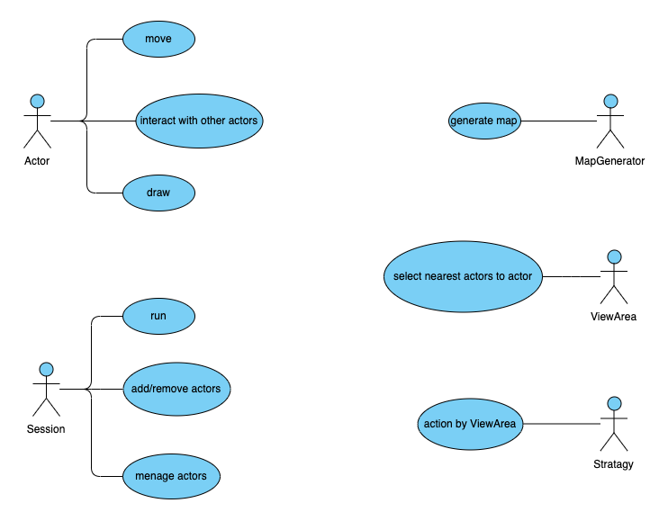
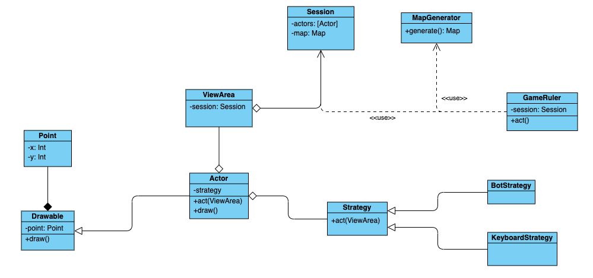

# Roguelike
Roguelike game for Software Design course

## Общие сведения о системе
Разрабатываемая система игра в жанре Roguelike. Жанр подразумевает генерацию карты случайным образом, наличие врагов с несколькими стратегиями поведения и персонажа игрока, управляемого с клавиатуры.
В процессе разработке системы предполагается использовать готовые библиотеки взаимодействия с консоль и стандартную библиотеку языка. Таким образом, в границы системы входит -- генератор карт, набор стратегий для врагов и автомат управляющий течением игры.
Система является одиночной игрой, подразумевается использование её одним игроком. Требованием к системе пользователя является наличие Java Virtual Machine не менее 1.8 версии. 

## Architectural drivers
Игра в основном определяется картой. Более того, ни игрок, ни враги действовать без неё не могут. Таким образом существует некоторая явная связь в предметной области между акторами и картой. Её мы выносим в понятие “сессия”. Сессией является объединение карты, акторов и машины управления игрой.
Игры как таковые накладывают некоторые ограничения на акторов. К примеру, если все враги будут видеть неограниченно далеко, то они просто сбегутся к месту нахождения игрока и побьют его числом. Мы абстрагируем понятие “зрения” актора в “ViewArea” -- это своего рода фильтр преобразующий информацию из сессии (о местоположении всех акторов) в ту, что должна быть доступна конкретному актору. Кроме того, такое решение позволяет гибко изменять поля зрения и создавать более интересных врагов.
Поставленная задача требует реализации различных стратегий поведения акторов. Совершенно очевидно, что в таком случае будет удобно использовать паттерн “стратегия” для определения различных моделей поведения врагов.
Желательным требованием является мультиплатформенность игры (ну потому что терминал то везде есть, чего бы ей не быть мультиплатформенной). Поэтому решено использовать JVM как мультиплатформенную среду исполнения и библиотеку совместимую с VT100 протоколом

## Use-case diagram

## UML class diagram

